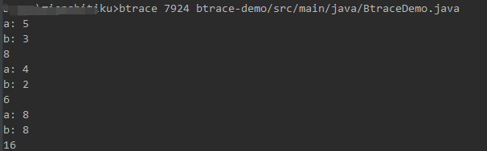

# BTrace 入门教程

> 在生产环境，如何排查疑难杂症？如何动态获取应用信息？这是我们许多Java程序员头痛的问题，自从有了 BTrace 很多问题便迎刃而解。

## BTrace 是什么？

顾名思义，我们都知道单词trace，指跟踪，那么BTrace肯定就是跟调试有关的一款工具。

官方解释：是一款可靠的，用来动态跟踪Java程序的工具。可通过动态对运行中的Java程序进行字节码生成来工作。BTrace会对运行中的Java程序的类插入一些跟踪操作，来对被跟踪的程序进行热替换。

BTrace 之所以称为神器，主要是它直接attach应用JVM，不用重启应用进程，可快速定位问题。

## 认识 BTrace

去官网下载 BTrace，配置环境变量以便在任何路径下能执行 btrace 命令。

在 %BTRACE_HOME%\bin 目录下，我们会发现三个脚本：btrace、btracec、btracer。

btrace：对运行中的JAVA程序执行btrace脚本。
btracec：预编译BTrace脚本，在编译期验证脚本正确性。
btracer：同时启动应用程序和BTrace脚本。

## 知识点

1. 类注解

@BTrace

指明该java类为一个btrace脚本文件。

2. 方法注解

|    注解名    | 说明                               |
| :-------: | -------------------------------- |
| @OnMethod | 指明该方法在什么情况下被执行。 |
| @OnTimer | 定时执行该方法。| |
| @OnExit | 当脚本运行Sys.exit(code)时执行该方法。|
| @OnError | 当脚本运行抛出异常时执行该方法。|
| @OnEvent | 脚本运行时Ctrl+C可以发送事件。 |
| @OnLowMemory | 指定一个内存阀值，低于阀值值执行该方法。|
| @OnProbe | 指定一个xml文件来描述在什么时候执行该方法。|
| @Sampled | 为注释的处理程序启用采样。与@OnMethod注释一起使用。|

@OnMethod 是一个常用的注解，需要重点掌握；它的属性如下：

clazz：指定要跟踪的类；
method：指定要追踪的方法。
type：指定要被跟踪的方法的签名；一般可以不声明，绝大部分情况下依靠clazz和method即可确定要跟踪的方法。
location：指定要跟踪的方法的位置。如@Location(Kind.RETURN)表示方法返回处，@Location(Kind.ENTRY)表示方法入口处，@Location(Kind.ERROR)表示异常没被捕获被抛出目标方法之外时，
@Location(Kind.THROW)表示异常抛出时，@Location(Kind.CATCH)表示异常被捕获时，@Location(Kind.CALL)表示被调用时，@Location(Kind.CALL)表示被调用时，@Location(Kind.Line)表示执行到某行时。

3. 方法参数注解

|    注解名    | 说明                               |
| :-------: | -------------------------------- |
| @Self | 指目标对象本身。|
| @Retrun | 指目标程序方法返回值(需要配合Kind.RETURN)。|
| @ProbeClassName | 指目标类名。|
| @ProbeMethodName | 指目标方法名。|
| @targetInstance | 指@Location指定的clazz和method的目标(需要配合Kind.CALL)。|
| @targetMethodOrField | 指@Location指定的clazz和method的目标的方法或字段(需要配合Kind.CALL)。|
| @Duration | 指目标方法执行时间，单位是纳秒(需要需要配合Kind.RETURN或Kind.ERROR一起使用）。|


## 入门实例

其实例子可以去 %BTRACE_HOME%\samples\ 目录找。

作者建议在写脚本的时候，引入 maven 相关依赖，这样做的好处在于能够只能提示，如下：

```
<dependency>
    <groupId>com.sun.tools.btrace</groupId>
    <artifactId>btrace-boot</artifactId>
    <version>1.2.3</version>
    <scope>provided</scope>
</dependency>
<dependency>
    <groupId>com.sun.tools.btrace</groupId>
    <artifactId>btrace-agent</artifactId>
    <version>1.2.3</version>
    <scope>provided</scope>
</dependency>
```

Demo.java 如下:

```java
public class Demo {

    public static int add(int a, int b) {
        try {
            Thread.sleep(5000);
        } catch (InterruptedException e) {
            e.printStackTrace();
        }
        return a + b;
    }

    public static void main(String[] args) {
        Random random = new Random();

        while (true) {
            System.err.println("result:" + add(random.nextInt(10), random.nextInt(10)));
        }
    }
}
```

BtraceDemo.java 如下:


```java
@BTrace
public class BtraceDemo {

    @OnMethod(
            clazz = "Demo",
            method = "add",
            location = @Location(Kind.RETURN)
    )
    public static void sayHello(int a, int b, @Return String result) {
        println("a: " + a);
        println("b: " + b);
        println(result);
    }
}
```

运行命令：

```bash
btrace 4100 btrace-demo/src/main/java/BtraceDemo.java
```

测试结果：




这里只是一个简单的例子入门，更加复杂的线上操作实例，需要根据具体的业务来写，建议大家多去看一下btrace作者提供的实例。

## 参考

wiki：https://github.com/btraceio/btrace/wiki

github：https://github.com/btraceio/btrace

代码自动生成工具： https://btrace.org/btrace/